This script is a template workflow for scoring Qualtrics data using the [`scorequaltrics`](https://github.com/jflournoy/qualtrics) package built by [John Flournoy](https://github.com/jflournoy) and is a pared down version of the tutorial he created for the TDS study.

Generate a credentials file
---------------------------

To pull data from Qualtrics, you need a credentials file with an API token associated with your account. To create the file, follow these steps.

1.  Generate an API token for Qualtrics. Follow the steps outlined [here](https://www.qualtrics.com/support/integrations/api-integration/overview/)

2.  Create `credentials.yaml.DEFAULT` in the `credentialDir` and add API token information

``` bash
credentialDir='/Users/danicosme/' #replace with your path

if [ ! -f ${credentialDir}credentials.yaml.DEFAULT ]; then
  cd ${credentialDir}
  touch credentials.yaml.DEFAULT
  echo "user: dcosme#oregon" >> credentials.yaml.DEFAULT #replace with your token information
  echo "token: IhaSx923jsjDjaSKDjh..." >> credentials.yaml.DEFAULT #replace with your token information
else
  echo "credential file already exists in this location"
fi
```

    ## credential file already exists in this location

Define variables and paths
--------------------------

-   `cred_file_location` = path to your Qualtrics credential file. You'll need to generate this via Qualtrics using the instructios above.
-   `id_column_name` = subject ID column name in Qualtrics survey; can be a regular expression

``` r
cred_file_location = '~/credentials.yaml.DEFAULT'
sid_column_name = '(SID|ExternalDataReference|qid)'
survey_name_filter = 'Freshman Project T.* Survey'
sid_pattern = 'FP[0-9]{3}'
exclude_sid = 'FP999' # subject IDs to exclude
identifiableData = c('Name', 'EmailAddress', 'IPAddress') # exclude when printing duplicates
output_file_dir = '~/Documents/code/score-qualtrics/'
rubric_dir = '~/Documents/code/score-qualtrics/rubrics'
```

Packages
--------

``` r
if (!require(tidyverse)) {
  install.packages('tidyverse')
}

if (!require(knitr)) {
  install.packages('knitr')
}

if (!require(devtools)) {
  install.packages('devtools')
}

if (!require(scorequaltrics)) {
  devtools::install_github('jflournoy/qualtrics')
}

if (!require(ggcorrplot)) {
  install.packages('ggcorrplot')
}
```

Access qualtrics data
---------------------

Filter available surveys based on the filter specified above.

``` r
# load credential file
credentials = scorequaltrics::creds_from_file(cred_file_location)

# filter
surveysAvail = scorequaltrics::get_surveys(credentials)
surveysFiltered = filter(surveysAvail, grepl(survey_name_filter, SurveyName))

knitr::kable(arrange(select(surveysFiltered, SurveyName), SurveyName))
```

| SurveyName                         |
|:-----------------------------------|
| Freshman Project T1 Survey (Pilot) |
| Freshman Project T2 Survey (Pilot) |
| Freshman Project T3 Survey (Pilot) |
| Freshman Project T4 Survey (Pilot) |

Cleaning and scoring data
-------------------------

### Get survey data

The `get_survey_data` funcion pulls the data from the surveys specified in `surveysFiltered` and reshapes into the long format. Because the example data also includes some identifying information, we also want to filter those items out of our dataframe.

``` r
# get data
surveys_long = scorequaltrics::get_survey_data(surveysFiltered,
                                               credentials, 
                                               pid_col = sid_column_name) %>%
               filter(!item %in% identifiableData) #filter out identifiable data

# print first 10 rows
head(select(surveys_long, -qid), 10)
```

    ## Source: local data frame [10 x 5]
    ## Groups: <by row>
    ## 
    ## # A tibble: 10 x 5
    ##    ExternalDataRefere… item      value        survey_name             SID  
    ##    <chr>               <chr>     <chr>        <chr>                   <chr>
    ##  1 FP029               Response… Default Res… Freshman Project T2 Su… <NA> 
    ##  2 FP007               Response… Default Res… Freshman Project T2 Su… <NA> 
    ##  3 FP009               Response… Default Res… Freshman Project T2 Su… <NA> 
    ##  4 FP022               Response… Default Res… Freshman Project T2 Su… <NA> 
    ##  5 FP004               Response… Default Res… Freshman Project T2 Su… <NA> 
    ##  6 FP011               Response… Default Res… Freshman Project T2 Su… <NA> 
    ##  7 FP021               Response… Default Res… Freshman Project T2 Su… <NA> 
    ##  8 FP013               Response… Default Res… Freshman Project T2 Su… <NA> 
    ##  9 FP008               Response… Default Res… Freshman Project T2 Su… <NA> 
    ## 10 FP018               Response… Default Res… Freshman Project T2 Su… <NA>

### Load scoring rubrics

To automatically score the surveys, scoring rubrics with the following format must be provided:

``` r
read.csv('examplerubric.csv', stringsAsFactors = FALSE, check.names = FALSE)
```

    ##                Data File Name Scale Name Column Name Reverse Min Max
    ## 1  Freshman Project T1 Survey        BIS       BIS_1       0   1   4
    ## 2  Freshman Project T1 Survey        BIS       BIS_2       0   1   4
    ## 3  Freshman Project T1 Survey        BIS       BIS_3       0   1   4
    ## 4  Freshman Project T1 Survey        BIS       BIS_4       0   1   4
    ## 5  Freshman Project T1 Survey        BIS       BIS_5       0   1   4
    ## 6  Freshman Project T1 Survey        BIS       BIS_6       1   1   4
    ## 7  Freshman Project T1 Survey        BIS       BIS_7       1   1   4
    ## 8  Freshman Project T1 Survey        BIS       BIS_8       1   1   4
    ## 9  Freshman Project T1 Survey        BIS       BIS_9       1   1   4
    ## 10 Freshman Project T1 Survey        BIS      BIS_10       1   1   4
    ## 11 Freshman Project T1 Survey        BIS      BIS_11       0   1   4
    ## 12 Freshman Project T1 Survey        BIS      BIS_12       0   1   4
    ## 13 Freshman Project T1 Survey        BIS      BIS_13       1   1   4
    ## 14 Freshman Project T1 Survey        BIS      BIS_14       0   1   4
    ## 15 Freshman Project T1 Survey        BIS      BIS_15       0   1   4
    ##    Transform Nonplanning_Impulsivity_T1 Motor_Impulsivity_T1
    ## 1          0                          0                  sum
    ## 2          0                          0                  sum
    ## 3          0                          0                  sum
    ## 4          0                          0                  sum
    ## 5          0                          0                  sum
    ## 6          0                        sum                    0
    ## 7          0                        sum                    0
    ## 8          0                        sum                    0
    ## 9          0                        sum                    0
    ## 10         0                        sum                    0
    ## 11         0                          0                    0
    ## 12         0                          0                    0
    ## 13         0                          0                    0
    ## 14         0                          0                    0
    ## 15         0                          0                    0
    ##    Attentional_Impulsivity_T1 Total
    ## 1                           0   sum
    ## 2                           0   sum
    ## 3                           0   sum
    ## 4                           0   sum
    ## 5                           0   sum
    ## 6                           0   sum
    ## 7                           0   sum
    ## 8                           0   sum
    ## 9                           0   sum
    ## 10                          0   sum
    ## 11                        sum   sum
    ## 12                        sum   sum
    ## 13                        sum   sum
    ## 14                        sum   sum
    ## 15                        sum   sum

Scoring rubrics should exist in `rubric_dir` and be named according to the following convention: `[measure]_scoring_rubric.csv`

``` r
# specify rubric paths
scoring_rubrics = data.frame(file = dir(file.path(rubric_dir), 
                                        pattern = '.*scoring_rubric.*.csv',
                                        full.names = TRUE))

# read in rubrics
scoring_data_long = scorequaltrics::get_rubrics(scoring_rubrics,
                                                type = 'scoring')
# print the first 10 rows
head(scoring_data_long[, -1], 10)
```

    ## # A tibble: 10 x 9
    ##    data_file_name scale_name column_name reverse min   max   transform
    ##    <chr>          <chr>      <chr>       <chr>   <chr> <chr> <chr>    
    ##  1 Freshman Proj… BIS        BIS_1       0       1     4     0        
    ##  2 Freshman Proj… BIS        BIS_2       0       1     4     0        
    ##  3 Freshman Proj… BIS        BIS_3       0       1     4     0        
    ##  4 Freshman Proj… BIS        BIS_4       0       1     4     0        
    ##  5 Freshman Proj… BIS        BIS_5       0       1     4     0        
    ##  6 Freshman Proj… BIS        BIS_6       1       1     4     0        
    ##  7 Freshman Proj… BIS        BIS_7       1       1     4     0        
    ##  8 Freshman Proj… BIS        BIS_8       1       1     4     0        
    ##  9 Freshman Proj… BIS        BIS_9       1       1     4     0        
    ## 10 Freshman Proj… BIS        BIS_10      1       1     4     0        
    ## # … with 2 more variables: scored_scale <chr>, include <chr>

### Cleaning

-   exclude non-sub responses
-   convert missing values to NA
-   duplicates

First, exclude responses that are not subject responses. In this dataset, some subjects have their ID in the `ExternalDataReference` column only, so we'll need to add that to the `SID` column before filtering. There are also some test responses that match our SID pattern, so we'll want to exclude those using the `exclude_SID` pattern.

``` r
surveys_long_sub = surveys_long %>%
  mutate(SID = ifelse(is.na(SID), ExternalDataReference, SID)) %>%
  select(-ExternalDataReference) %>%
  filter(grepl(sid_pattern, SID)) %>%
  filter(!grepl(exclude_sid, SID)) %>%
  arrange(SID)

# print unique SIDs
unique(surveys_long_sub$SID)
```

    ##  [1] "FP001" "FP002" "FP003" "FP004" "FP005" "FP006" "FP007" "FP008"
    ##  [9] "FP009" "FP010" "FP011" "FP012" "FP013" "FP014" "FP015" "FP016"
    ## [17] "FP017" "FP018" "FP019" "FP020" "FP021" "FP022" "FP023" "FP024"
    ## [25] "FP025" "FP026" "FP027" "FP028" "FP029" "FP030" "FP031" "FP032"
    ## [33] "FP034" "FP035"

Convert missing values to NA.

``` r
surveys_long_na = surveys_long_sub %>%
  mutate(value = ifelse(value == "", NA, value))
```

Check for non-numeric items using the `get_uncoercibles()` function.

``` r
surveys_long_na %>%
  scorequaltrics::get_uncoercibles() %>%
  distinct(item, value) %>%
  arrange(item) %>%
  head(., 10)
```

    ##            item                                value
    ## 1  CARE_EI_22OD                                 MDMA
    ## 2         CVS_1                             18 years
    ## 3        CVS_15                                3.47?
    ## 4        CVS_16                         3. Something
    ## 5        CVS_16                                 3.7?
    ## 6         CVS_3 caucasian, american indian  (Seneca)
    ## 7         CVS_3                             hispanic
    ## 8         CVS_3                            caucasion
    ## 9         CVS_3                            Caucasian
    ## 10        CVS_3                                white

Make manual edits before converting values to numeric during scoring

``` r
# save ethnicity information as a separate variable
CVS_3 = surveys_long_na %>%
  mutate(value = ifelse(item == "CVS_3", tolower(value), value)) %>%
  filter(item == "CVS_3")

# make manual edits and convert values to numeric
surveys_long_num = surveys_long_na %>%
  mutate(value = ifelse(SID == "FP007" & item == "CVS_1", "18",
                 ifelse(SID == "FP006" & item == "CVS_15", "3.47",
                 ifelse(SID == "FP002" & item == "CVS_16", "3",
                 ifelse(SID == "FP006" & item == "CVS_16", "3.7", value)))))
```

Check for duplicate responses. There is a `clean_dupes` function that can do this, but since we have multiple waves with the same surveys, we're going to do this homebrew.

``` r
surveys_long_num %>%
  spread(item, value) %>%
  group_by(survey_name, SID) %>%
  summarize(n = n()) %>%
  arrange(desc(n)) %>%
  filter(n > 1)
```

    ## # A tibble: 1 x 3
    ## # Groups:   survey_name [1]
    ##   survey_name                        SID       n
    ##   <chr>                              <chr> <int>
    ## 1 Freshman Project T2 Survey (Pilot) FP002     2

Since FP002 appears to have taken the T2 survey twice, we're simply going to randomly select based on the qid

``` r
surveys_long_clean = surveys_long_num %>%
  filter(!qid == "R_11YpEE2pH9Ozqvk") %>%
  select(-qid)
```

First, get only the items used in the scoring rubrics.

``` r
get_items_in_rubric_nonnumeric <- function(dataDF, rubricDF){
  dataDT <- as.data.table(dataDF)
  rubricCols <- rubricDF$column_name[rubricDF$include %in% c(1, "1", "sum", "prod", "I")]
  smallDF <- as.data.frame(dataDT[item %in% rubricCols])
  return(smallDF)
}

scoring = get_items_in_rubric_nonnumeric(surveys_long_clean, scoring_data_long)
```

### Scoring almost all at once

From John:

> There are a few different options for scoring questionnaires. First, we can provide a rubric and data to `scorequaltrics::score_questionnaire(dataDF, rubricsDF, psych = TRUE)`, which will use the `psych` package to do the scoring. This has the advantage that you get back a lot of information about the measurement quality of the scale, but it only works for scales that follow certain psychometric principles (e.g., each item is rated on a continuous scale, and is an indicator of a latent construct). It won't work well for other kinds of data (like scales where you want to know the number of risky behaviors, for example). The second option is to use `scorequaltrics::score_step_one_and_two(dataDF, rubricsDF)` which was created to take care of several special cases for the TDS project questionnaires. The RPI, and RSQ both require special handling because of their idiosyncratic questionnaire design.

### Modify `score_questionnaire_dsn`

Change the function to also group by `survey_name` to be able to score multiple time points at once. This is not necessary if you only have one timepoint or survey you're scoring.

``` r
#' Score items
#'
#' @param item_values item_values
#' @param scoring_methods scoring_methods
#' @param na.rm na.rm
#' @param mean.na.rm mean.na.rm
#' @param scale_name scale_name
#' @param scored_scale scored_scale
score_items<-function(item_values,scoring_methods,na.rm=F,mean.na.rm=T,scale_name='', scored_scale='', SID=''){
  # item_values should be a vector of numbers
  # scoring_methods should be a function that takes a vector, or '1'
  #check that all elements in `scoring` are the same

  if(!all(scoring_methods[1]==scoring_methods))
    stop(paste0('Scoring methods not all the same. Check that you\'re\n',
                'grouping rows correctly, and that the rubric is correct.\n',
                '(scale name is ',scale_name,', scored scale is ',scored_scale,')\n',
                paste(scoring_methods, collapse='\n')))
  
  length_vars <- lapply(list(item_values, scoring_methods), length)
  detail_vars <- list(SID = SID, scale_name = scale_name, scored_scale = scale_name)
  length_details <- lapply(detail_vars, length)
  if(any(!length_vars > 0)){
      message('Empty values or scoring method vector...')
      if(any(length_details > 0)){
          details <- detail_vars[which(length_details > 0)]
          message('Details: ', 
                  paste(paste(names(details), details, sep = ': '), collapse = ', '),
                  '.')
      } else {
          message('No scale or subscale info.')
      }
      return(NA)
  }
  
  scoring_method <- unique(scoring_methods)
  scoring_is_mean <- try(scoring_method == 1)
  
  if (!inherits(scoring_is_mean, what = 'try-error') && scoring_is_mean){
    scoring_func<-mean
    na.rm=mean.na.rm
  } else {
    scoring_func<-try(get(scoring_method))
  }
  if (inherits(scoring_func, what = 'try-error')){
      if(any(length_details > 0)){
          details <- detail_vars[which(length_details > 0)]
          message('Details: ', 
                  paste(paste(names(details), details, sep = ': '), collapse = ', '),
                  '.')
      } else {
          message('No scale or subscale info.')
      }  
    stop(paste0('Scoring method "',scoring_method,'" not found.'))
  }
  if(na.rm) {
    do_for_na<-na.exclude
  } else {
    do_for_na<-na.pass
  }
  return(scoring_func(do_for_na(item_values)))
}

#' Reverse score
#'
#' @param item_values item_values
#' @param min min
#' @param max max
reverse_score<-function(
  item_values,
  min=stop('Must specify min and max score.'),
  max=stop('Must specify min and max score.')){
  rev_items<-max+min-item_values
  rev_items
}

#' transform scores
#'
#' @param item_values item_values
#' @param transformation transformation
#' @param min min
#' @param max max
transform_scores<-function(item_values,transformation,min=NA,max=NA){
  #`transformation` should be a function defined in terms of x that will
  # be applied to the vector of item_values.
  #Conditional logic will be extracted for subsetting, also in terms of x.
  #`min` and `max` will be passed to `reverse_score` and `pomp_score`.
  #check that all elements in `transformation` are the same
  if(!all(transformation[1]==transformation))
    stop('Scoring methods not all the same. Check that you\'re
         grouping rows correctly, and that the rubric is correct.')
  transformation<-unique(transformation)
  if(regexpr('^if *(\\(.*\\))( | *\\{).*',transformation) != -1){
    logic<-sub('^if *(\\(.*\\))( | *\\{).*','\\1',transformation)
    aFunction<-sub('^if *(\\(.*\\))( | *\\{)(.*)','\\3',transformation)
  }
  else {
    logic<-NULL
    aFunction<-transformation
  }
  if(grepl('reverse_score$',aFunction)){
    aFunction<-paste(aFunction,'(x,min,max)')
  }
  if(!grepl('^function(x)',aFunction)){
    aFunction<-paste('function(x) ',aFunction)
  }
  aFunction<-eval(parse(text=aFunction))
  x<-item_values
  if(is.null(logic)){
    aFunction(x)
  }
  else {
    ifelse(
      eval(parse(text=logic)),
      aFunction(x),
      x)
  }
}

score_questionnaire_dsn <- function(dataDF,rubricsDF,SID){
  #Takes long-form question data and rubric data, and a logical
  # value specifying whether to use _part2 rubrics.
  #Returns scored scales.
  if(any(dim(dataDF)[1] < 1, dim(rubricsDF)[1] < 1)){
      return(data.frame())
  }
  scores_with_scoring_params<-rubricsDF  %>%
    left_join(
      dataDF,
      by=c(
        #"data_file_name" = "survey_name",
        "column_name" = "item")) %>%
    filter(!(include %in% c(0,NA,'0','NA',''))) # this filters the rubrics

  nonNumeric_items <- scores_with_scoring_params %>% filter(include %in% 'I')
  
  if(!is.na(dim(nonNumeric_items)[1]) && dim(nonNumeric_items)[1] > 0){
      non_numeric <- nonNumeric_items %>%
          mutate(na.rm=F) %>%
          group_by(survey_name,scale_name,scored_scale,SID) %>%
          summarise(
              score=scorequaltrics:::score_items(
                  value,
                  include,
                  scale_name=scale_name[[1]],
                  scored_scale=scored_scale[[1]],
                  SID = SID[[1]]),
              n_items=sum(!is.na(value)),
              n_missing=sum(is.na(value)),
              method=unique(include))
  } else {
      non_numeric <- data.frame()
  }

  transform_scored<-
    scores_with_scoring_params %>%
    group_by(column_name) %>%
    mutate(
      value=as.numeric(
        ifelse(
          !(transform %in% c(0,NA,'')),
          scorequaltrics:::transform_scores(
            value,
            transform,
            min=as.numeric(min[[1]]),
            max=as.numeric(max[[1]])),
          value)))

  reverse_scored<-
    transform_scored %>%
    group_by(column_name) %>%
    mutate(
      value=as.numeric(
        ifelse(
          reverse %in% 1,
          scorequaltrics:::reverse_score(
            value,
            min=as.numeric(min[[1]]),
            max=as.numeric(max[[1]])),
          value))) %>%
    filter(!include %in% 'I')

  scored<-reverse_scored %>%
    mutate(na.rm=F) %>%
    group_by(survey_name,scale_name,scored_scale,SID) %>%
    summarise(
      score=scorequaltrics:::score_items(
          value,
          include,
          scale_name=scale_name[[1]],
          scored_scale=scored_scale[[1]],
          SID = SID[[1]]),
      n_items=sum(!is.na(value)),
      n_missing=sum(is.na(value)),
      method=unique(include)) %>%
    mutate(
      score=as.character(score)) %>%
    bind_rows(non_numeric,.)
  return(scored)
}

#' Score questionnaire
#'
#' @param dataDF A data.frame as returned by \code{\link{get_survey_data}}
#' @param rubricsDF A data.frame as returned by \code{\link{get_rubrics}}
#' @param psych A flag specifying whether \code{\link[psych]{psych-package}} should be used for scoring. Default is \code{FALSE} but you should probably set it to \code{TRUE} unless you're using this for a DSN lab project
#' @param ... Other arguments passed to one of the scoring engines.
#'
#' @return A long-form data.frame with scale scores.
#' @export
score_questionnaire_homebrew<-function(dataDF, rubricsDF, SID, psych = FALSE, ...){
  if(psych){
    return(score_questionnaire_psych(dataDF, rubricsDF, ...))
  } else {
    return(score_questionnaire_dsn(dataDF, rubricsDF, ...))
  }
}
```

### Score the questionnaires

Use the modified function to score the questionnaires

``` r
scored = score_questionnaire_homebrew(scoring, scoring_data_long, "SID")

# print first 200 rows
head(scored, 200)
```

    ## # A tibble: 200 x 8
    ## # Groups:   survey_name, scale_name, scored_scale [6]
    ##    survey_name scale_name scored_scale SID   score n_items n_missing method
    ##    <chr>       <chr>      <chr>        <chr> <chr>   <int>     <int> <chr> 
    ##  1 Freshman P… CVS        ethnicity_t… FP001 cauc…       1         0 I     
    ##  2 Freshman P… CVS        ethnicity_t… FP002 hisp…       1         0 I     
    ##  3 Freshman P… CVS        ethnicity_t… FP003 cauc…       1         0 I     
    ##  4 Freshman P… CVS        ethnicity_t… FP004 Cauc…       1         0 I     
    ##  5 Freshman P… CVS        ethnicity_t… FP005 white       1         0 I     
    ##  6 Freshman P… CVS        ethnicity_t… FP006 White       1         0 I     
    ##  7 Freshman P… CVS        ethnicity_t… FP007 Cauc…       1         0 I     
    ##  8 Freshman P… CVS        ethnicity_t… FP008 White       1         0 I     
    ##  9 Freshman P… CVS        ethnicity_t… FP009 white       1         0 I     
    ## 10 Freshman P… CVS        ethnicity_t… FP010 White       1         0 I     
    ## # … with 190 more rows

### Convert score to numerical

``` r
scored_num = scored %>%
  mutate(score = ifelse(score == "NaN", NA, score),
         score = as.numeric(score))

# print first 200 rows
head(scored_num, 200)
```

    ## # A tibble: 200 x 8
    ## # Groups:   survey_name, scale_name, scored_scale [6]
    ##    survey_name scale_name scored_scale SID   score n_items n_missing method
    ##    <chr>       <chr>      <chr>        <chr> <dbl>   <int>     <int> <chr> 
    ##  1 Freshman P… CVS        ethnicity_t… FP001    NA       1         0 I     
    ##  2 Freshman P… CVS        ethnicity_t… FP002    NA       1         0 I     
    ##  3 Freshman P… CVS        ethnicity_t… FP003    NA       1         0 I     
    ##  4 Freshman P… CVS        ethnicity_t… FP004    NA       1         0 I     
    ##  5 Freshman P… CVS        ethnicity_t… FP005    NA       1         0 I     
    ##  6 Freshman P… CVS        ethnicity_t… FP006    NA       1         0 I     
    ##  7 Freshman P… CVS        ethnicity_t… FP007    NA       1         0 I     
    ##  8 Freshman P… CVS        ethnicity_t… FP008    NA       1         0 I     
    ##  9 Freshman P… CVS        ethnicity_t… FP009    NA       1         0 I     
    ## 10 Freshman P… CVS        ethnicity_t… FP010    NA       1         0 I     
    ## # … with 190 more rows

Plots
-----

### Distributions

Grouped by scale

``` r
scored_num %>%
  group_by(scale_name) %>%
    do({
      plot = ggplot(., aes(scored_scale, score)) +
        geom_boxplot() +
        geom_jitter(height = .01, width = .15, alpha = .5, color = "#2A908B") +
        labs(x = "", y = "score\n", title = sprintf("%s\n", .$scale_name[[1]])) + 
        theme_minimal(base_size = 16) +
        theme(text = element_text(family = "Futura Medium", colour = "black"),
              legend.text = element_text(size = 8),
              axis.text = element_text(color = "black"),
              axis.text.x = element_text(angle = 45, vjust = 1, hjust = 1),
              panel.grid.major = element_blank(),
              panel.grid.minor = element_blank(),
              panel.border = element_blank(),
              panel.background = element_blank(),
              plot.title = element_text(hjust = 0.5))
      print(plot)
      data.frame()
    })
```

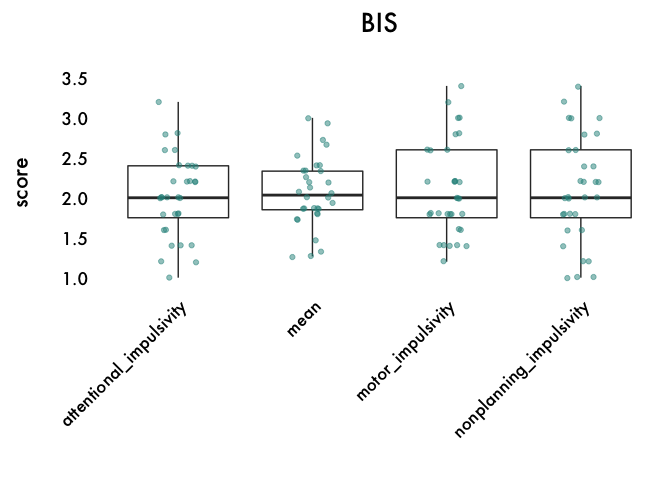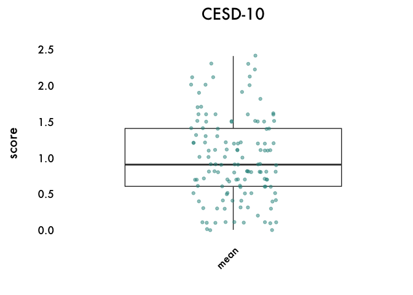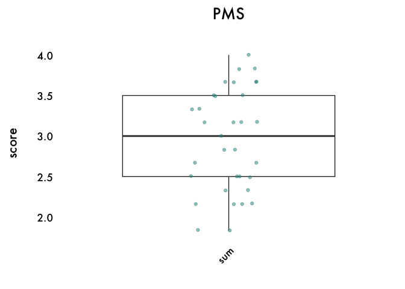

    ## # A tibble: 0 x 1
    ## # Groups:   scale_name [0]
    ## # … with 1 variable: scale_name <chr>

Grouped by scored scale

``` r
scored_num %>%
  filter(!scored_scale == "ethnicity_text") %>%
  group_by(scale_name, scored_scale) %>%
    do({
      plot = ggplot(., aes(scored_scale, score)) +
        geom_boxplot() +
        geom_jitter(height = .01, width = .15, alpha = .5, color = "#2A908B") +
        labs(x = "", y = "score\n", title = sprintf("%s %s\n", .$scale_name[[1]], .$scored_scale[[1]])) + 
        theme_minimal(base_size = 16) +
        theme(text = element_text(family = "Futura Medium", colour = "black"),
              axis.text = element_text(color = "black"),
              axis.text.x = element_text(angle = 45, vjust = 1, hjust = 1),
              panel.grid.major = element_blank(),
              panel.grid.minor = element_blank(),
              panel.border = element_blank(),
              panel.background = element_blank(),
              plot.title = element_text(hjust = 0.5))
      print(plot)
      data.frame()
    })
```

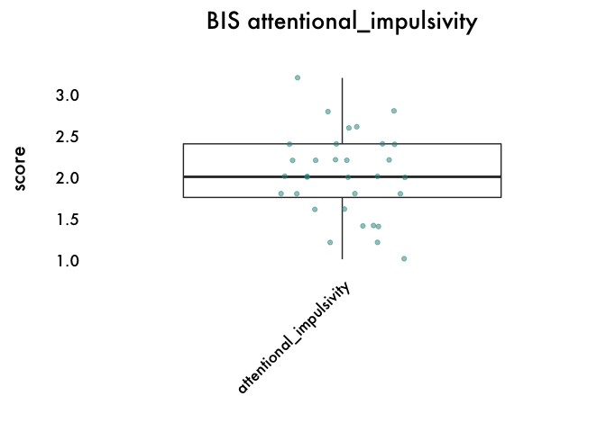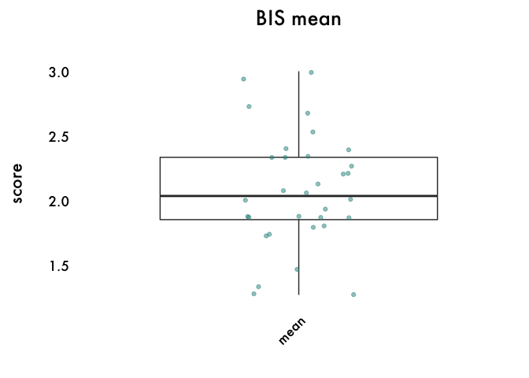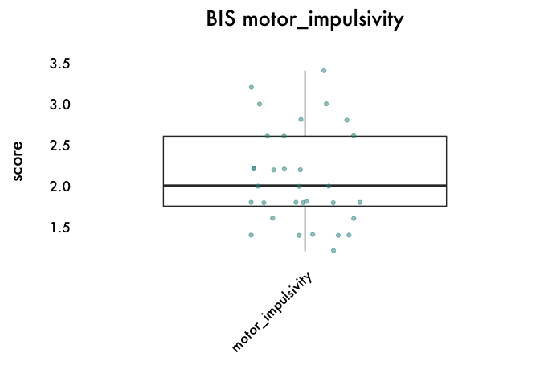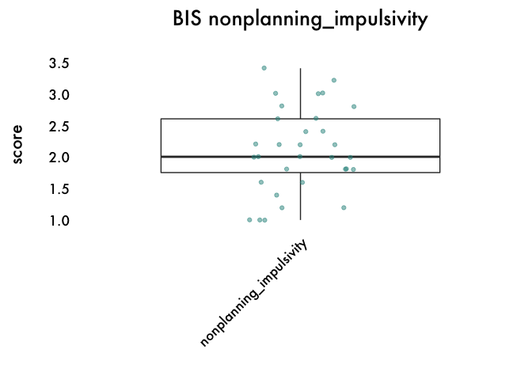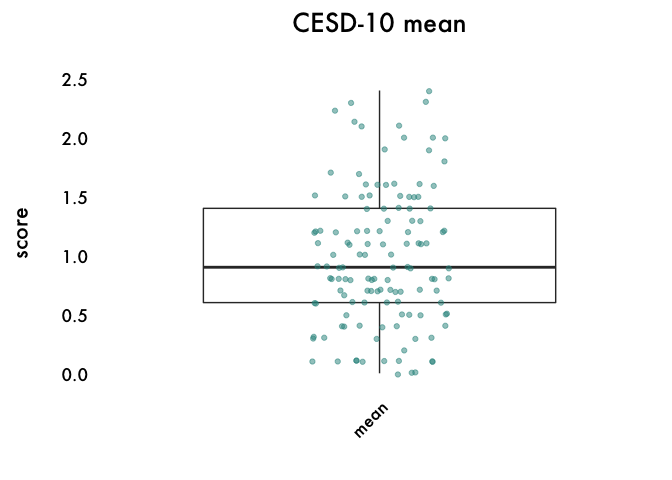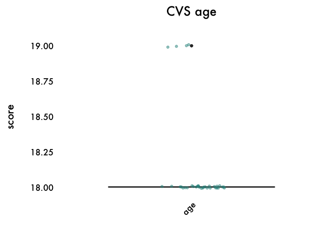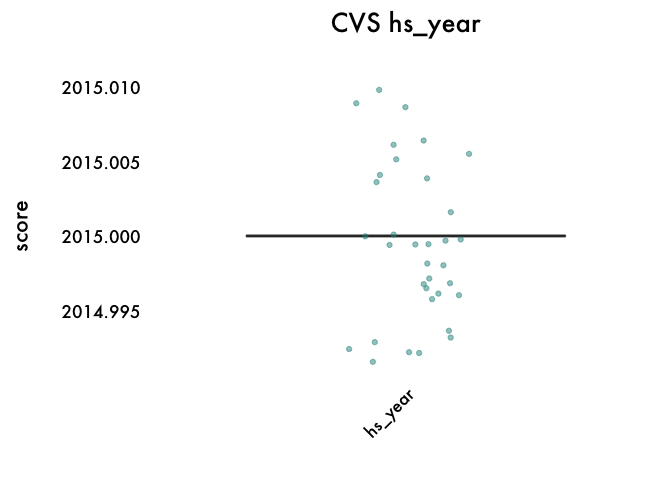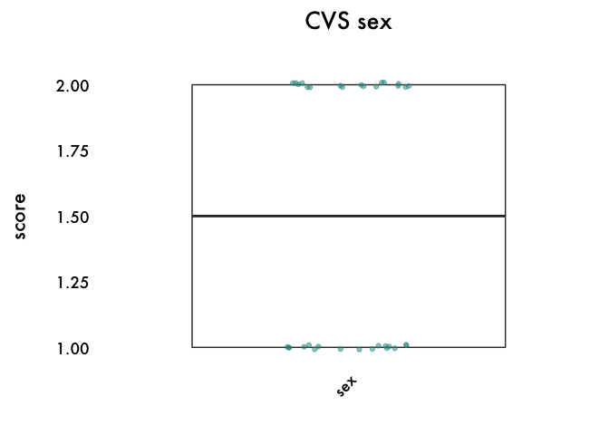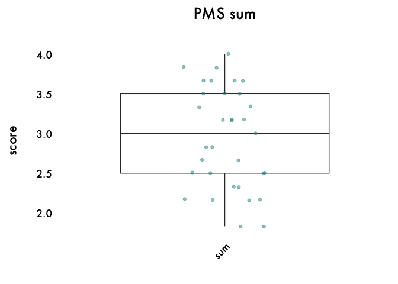

    ## # A tibble: 0 x 2
    ## # Groups:   scale_name, scored_scale [0]
    ## # … with 2 variables: scale_name <chr>, scored_scale <chr>

### Proportion of missing data

``` r
scored_num %>%
  group_by(scale_name) %>%
    do({
      plot = ggplot(., aes(scored_scale, n_missing)) +
        geom_violin() +
        geom_jitter(height = .01, width = .15, alpha = .5, color = "#2A908B") +
        labs(title = sprintf("%s %s\n", .$scale_name[[1]], .$scored_scale[[1]])) + 
        labs(x = "", y = "score\n") + 
        theme_minimal(base_size = 16) +
        theme(text = element_text(family = "Futura Medium", colour = "black"),
              axis.text = element_text(color = "black"),
              axis.text.x = element_text(angle = 45, vjust = 1, hjust = 1),
              panel.grid.major = element_blank(),
              panel.grid.minor = element_blank(),
              panel.border = element_blank(),
              panel.background = element_blank(),
              plot.title = element_text(hjust = 0.5))
      print(plot)
      data.frame()
    })
```

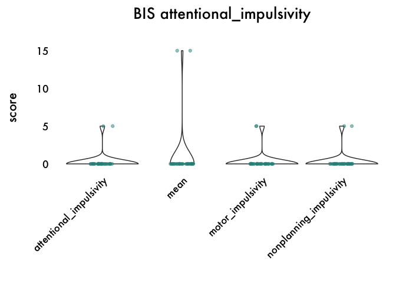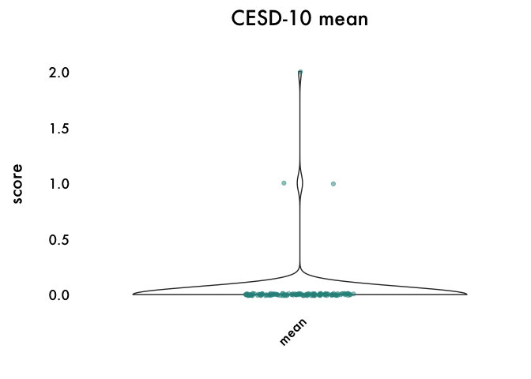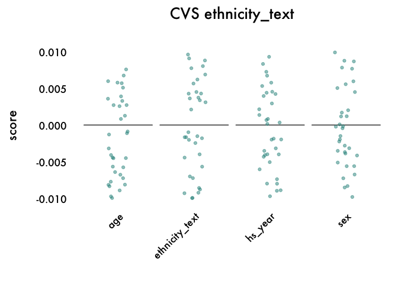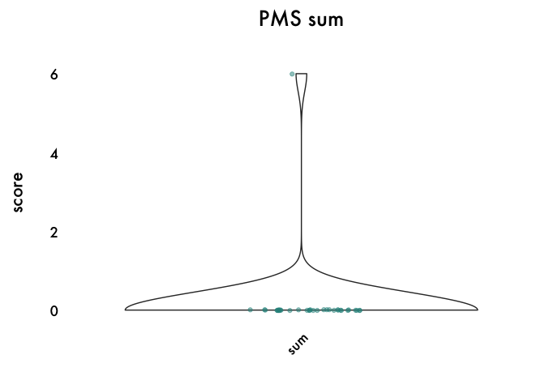

    ## # A tibble: 0 x 1
    ## # Groups:   scale_name [0]
    ## # … with 1 variable: scale_name <chr>

### Changes across time

For those variables that were measured more than once, plot changes.

``` r
scored_num %>%
  extract(survey_name, "wave", ".*([0-9]{1}).*", remove = FALSE) %>%
  group_by(scale_name, scored_scale) %>%
  mutate(nrow = n()) %>%
  filter(nrow > 34) %>%
    do({
      plot = ggplot(., aes(wave, score)) +
        geom_point(aes(group = SID), fill = "black", alpha = .05, size = 3) +
        geom_line(aes(group = SID), color = "black", alpha = .05, size = 1) +
        stat_summary(fun.data = "mean_cl_boot", size = 1.5, color = "#3B9AB2") +
        stat_summary(aes(group = 1), fun.y = mean, geom = "line", size = 1.5, color = "#3B9AB2") +
        labs(x = "\nwave", y = "score\n", title = sprintf("%s %s\n", .$scale_name[[1]], .$scored_scale[[1]])) + 
        theme_minimal(base_size = 16) +
        theme(text = element_text(family = "Futura Medium", colour = "black"),
              axis.text = element_text(color = "black"),
              axis.line = element_line(colour = "black"),
              panel.grid.major = element_blank(),
              panel.grid.minor = element_blank(),
              panel.border = element_blank(),
              panel.background = element_blank(),
              plot.title = element_text(hjust = 0.5))
      print(plot)
      data.frame()
    })
```

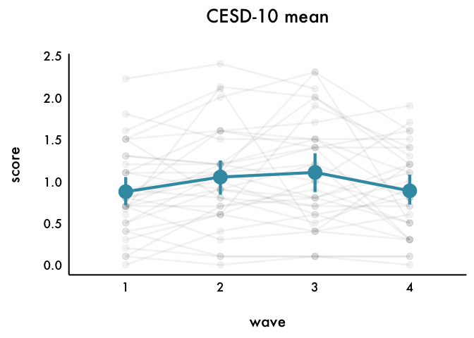

    ## # A tibble: 0 x 2
    ## # Groups:   scale_name, scored_scale [0]
    ## # … with 2 variables: scale_name <chr>, scored_scale <chr>

### Correlations

``` r
scored_num %>%
  filter(!scale_name == "CVS") %>%
  extract(survey_name, "wave", ".*(T[0-9]{1}).*", remove = FALSE) %>%
  mutate(var.name = paste(scale_name, scored_scale, wave, sep = " ")) %>%
  ungroup() %>%
  select(var.name, score, SID) %>%
  spread(var.name, score) %>%
  filter(!is.na(SID)) %>%
  select(-SID) %>%
  cor(., use = "pairwise.complete.obs") %>%
  ggcorrplot(hc.order = TRUE, outline.col = "white", colors = c("#3B9AB2", "white", "#E46726")) + 
    geom_text(aes(label = round(value, 2)), size = 4, family = "Futura Medium") +
    labs(x = "", y = "") + 
    theme_minimal(base_size = 16) +
    theme(text = element_text(family = "Futura Medium", colour = "black"),
          legend.text = element_text(size = 8),
          axis.text = element_text(color = "black"),
          axis.text.x = element_text(angle = 45, vjust = 1, hjust = 1),
          panel.grid.major = element_blank(),
          panel.grid.minor = element_blank(),
          panel.border = element_blank(),
          panel.background = element_blank())
```

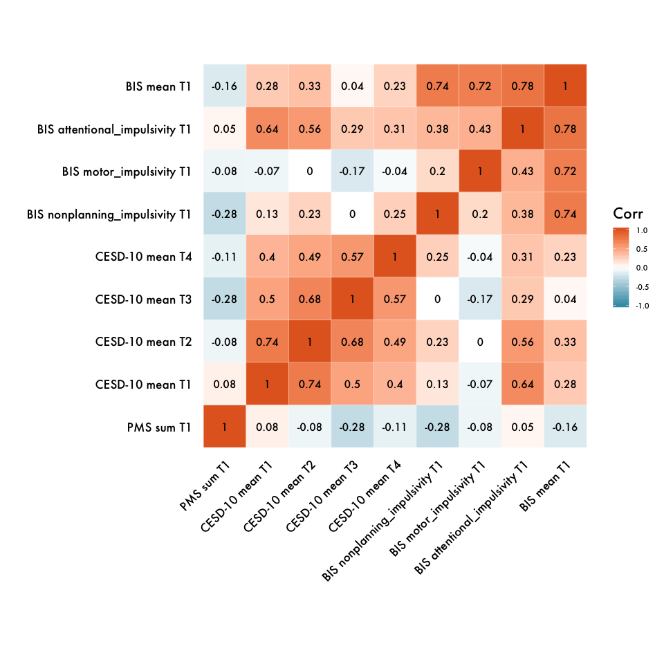
